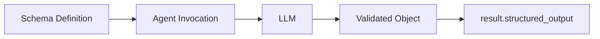
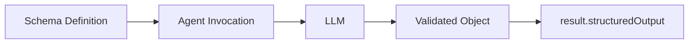

Use structured output when your application needs an object with specific fields. Define a schema, pass it to the agent, and read the validated object from the result.

(( tab "Python" ))

(( /tab "Python" ))

(( tab "TypeScript" ))

(( /tab "TypeScript" ))

## Basic Usage

To request structured output, pass a schema with `structured_output_model``structuredOutputSchema`. Read the validated object from `result.structured_output``result.structuredOutput`.

(( tab "Python" ))
Define the output fields with a [Pydantic model](https://docs.pydantic.dev/latest/concepts/models/):

```python
from pydantic import BaseModel, Field
from strands import Agent


class PersonInfo(BaseModel):
    name: str = Field(description="Name of the person")
    age: int = Field(description="Age of the person")
    occupation: str = Field(description="Occupation of the person")


agent = Agent()
result = agent(
    "John Smith is a 30 year-old software engineer",
    structured_output_model=PersonInfo
)

person_info: PersonInfo = result.structured_output
print(person_info.model_dump_json(indent=2))
```

Example output:

```json
{
  "name": "John Smith",
  "age": 30,
  "occupation": "software engineer"
}
```

For async code, pass `structured_output_model` to `await agent.invoke_async(...)`.

**Migrating from deprecated methods:** Pass `structured_output_model` to the agent invocation instead of calling `Agent.structured_output()` or `Agent.structured_output_async()`. Read the model from `result.structured_output`.
(( /tab "Python" ))

(( tab "TypeScript" ))
Define the output fields with a [Zod schema](https://zod.dev/) for runtime validation and type inference:

```typescript
import { Agent } from '@strands-agents/sdk'
import { z } from 'zod'

const PersonSchema = z.object({
  name: z.string().describe('Name of the person'),
  age: z.number().describe('Age of the person'),
  occupation: z.string().describe('Occupation of the person'),
})

type Person = z.infer<typeof PersonSchema>

const agent = new Agent({
  structuredOutputSchema: PersonSchema,
})

const result = await agent.invoke('John Smith is a 30 year-old software engineer')

const person = result.structuredOutput as Person
console.log(JSON.stringify(person, null, 2))
```

Example output:

```json
{
  "name": "John Smith",
  "age": 30,
  "occupation": "software engineer"
}
```
(( /tab "TypeScript" ))

## How It Works

Structured output converts your schema into a tool specification that guides the model toward a correctly formatted response. Every model provider Strands supports works with structured output.

Strands accepts the `structured_output_model``structuredOutputSchema` parameter in agent invocations, which manages the conversion, validation, and response processing automatically. The validated result is available in the `AgentResult.structured_output``AgentResult.structuredOutput` field.

## Error Handling

When structured output validation fails, Strands throws a custom exception that can be caught and handled appropriately:

(( tab "Python" ))
```python
from pydantic import ValidationError
from strands.types.exceptions import StructuredOutputException

try:
    result = agent(prompt, structured_output_model=MyModel)
except StructuredOutputException as e:
    print(f"Structured output failed: {e}")
```
(( /tab "Python" ))

(( tab "TypeScript" ))
```typescript
try {
  const result = await agent.invoke('some prompt')
} catch (error) {
  if (error instanceof StructuredOutputError) {
    console.log(`Structured output failed: ${error.message}`)
  }
}
```
(( /tab "TypeScript" ))

## Best Practices

-   **Keep schemas focused**: Define specific schemas for clear purposes
-   **Use descriptive field names**: Include helpful descriptions with field metadata
-   **Handle errors gracefully**: Implement proper error handling strategies with fallbacks

## Related Documentation

(( tab "Python" ))
-   [Models and schema definition](https://docs.pydantic.dev/latest/concepts/models/)
-   [Field types and constraints](https://docs.pydantic.dev/latest/concepts/fields/)
-   [Custom validators](https://docs.pydantic.dev/latest/concepts/validators/)
(( /tab "Python" ))

(( tab "TypeScript" ))
-   [Zod documentation](https://zod.dev/)
-   [Schema types](https://zod.dev/?id=primitives)
-   [Schema methods](https://zod.dev/?id=strings)
(( /tab "TypeScript" ))

## Cookbook

### Auto Retries with Validation

Automatically retry validation when initial extraction fails due to schema validation:

(( tab "Python" ))
```python
from strands.agent import Agent
from pydantic import BaseModel, field_validator


class Name(BaseModel):
    first_name: str

    @field_validator("first_name")
    @classmethod
    def validate_first_name(cls, value: str) -> str:
        if not value.endswith('abc'):
            raise ValueError("You must append 'abc' to the end of my name")
        return value


agent = Agent()
result = agent("What is Aaron's name?", structured_output_model=Name)
```
(( /tab "Python" ))

(( tab "TypeScript" ))
```typescript
const NameSchema = z.object({
  firstName: z.string().refine((val) => val.endsWith('abc'), {
    message: "You must append 'abc' to the end of my name",
  }),
})

const agent = new Agent({ structuredOutputSchema: NameSchema })
const result = await agent.invoke("What is Aaron's name?")
```
(( /tab "TypeScript" ))

### Streaming Structured Output

Stream agent execution while using structured output. The structured output is available in the final result:

(( tab "Python" ))
```python
from strands import Agent
from pydantic import BaseModel, Field

class WeatherForecast(BaseModel):
    """Weather forecast data."""
    location: str
    temperature: int
    condition: str
    humidity: int
    wind_speed: int
    forecast_date: str

streaming_agent = Agent()

async for event in streaming_agent.stream_async(
    "Generate a weather forecast for Seattle: 68°F, partly cloudy, 55% humidity, 8 mph winds, for tomorrow",
    structured_output_model=WeatherForecast
):
    if "data" in event:
        print(event["data"], end="", flush=True)
    elif "result" in event:
        print(f'The forecast for today is: {event["result"].structured_output}')
```
(( /tab "Python" ))

(( tab "TypeScript" ))
```typescript
const WeatherForecastSchema = z.object({
  location: z.string(),
  temperature: z.number(),
  condition: z.string(),
  humidity: z.number(),
  windSpeed: z.number(),
  forecastDate: z.string(),
})

type WeatherForecast = z.infer<typeof WeatherForecastSchema>

const agent = new Agent({ structuredOutputSchema: WeatherForecastSchema })

for await (const event of agent.stream(
  'Generate a weather forecast for Seattle: 68°F, partly cloudy, 55% humidity, 8 mph winds, for tomorrow'
)) {
  if (event.type === 'agentResultEvent') {
    const forecast = event.result.structuredOutput as WeatherForecast
    console.log(`The forecast is: ${JSON.stringify(forecast)}`)
  }
}
```
(( /tab "TypeScript" ))

### Combining with Tools

Combine structured output with tool usage to format tool execution results:

(( tab "Python" ))
```python
from strands import Agent
from strands.vended_tools import notebook
from pydantic import BaseModel, Field

class NotesResult(BaseModel):
    notebook_name: str = Field(description="the notebook that was updated")
    item_count: int = Field(description="the number of items added")

tool_agent = Agent(
    tools=[notebook]
)
res = tool_agent(
    'Create a notebook named "ideas" and add three project ideas.',
    structured_output_model=NotesResult,
)
```
(( /tab "Python" ))

(( tab "TypeScript" ))
```typescript
const calculatorTool = tool({
  name: 'calculator',
  description: 'Perform basic arithmetic operations',
  inputSchema: z.object({
    operation: z.enum(['add', 'subtract', 'multiply', 'divide']),
    a: z.number(),
    b: z.number(),
  }),
  callback: (input) => {
    const ops = {
      add: input.a + input.b,
      subtract: input.a - input.b,
      multiply: input.a * input.b,
      divide: input.a / input.b,
    }
    return ops[input.operation]
  },
})

const MathResultSchema = z.object({
  operation: z.string().describe('the performed operation'),
  result: z.number().describe('the result of the operation'),
})

const agent = new Agent({
  tools: [calculatorTool],
  structuredOutputSchema: MathResultSchema,
})
const result = await agent.invoke('What is 42 + 8')
```
(( /tab "TypeScript" ))

### Multiple Output Types

Reuse a single agent instance with different structured output schemas for varied extraction tasks:

(( tab "Python" ))
```python
from strands import Agent
from pydantic import BaseModel, Field
from typing import Optional

class Person(BaseModel):
    """A person's basic information"""
    name: str = Field(description="Full name")
    age: int = Field(description="Age in years", ge=0, le=150)
    email: str = Field(description="Email address")
    phone: Optional[str] = Field(description="Phone number", default=None)

class Task(BaseModel):
    """A task or todo item"""
    title: str = Field(description="Task title")
    description: str = Field(description="Detailed description")
    priority: str = Field(description="Priority level: low, medium, high")
    completed: bool = Field(description="Whether task is completed", default=False)


agent = Agent()
person_res = agent("Extract person: John Doe, 35, john@test.com", structured_output_model=Person)
task_res = agent("Create task: Review code, high priority, completed", structured_output_model=Task)
```
(( /tab "Python" ))

(( tab "TypeScript" ))
```typescript
const PersonSchema = z.object({
  name: z.string().describe('Full name'),
  age: z.number().min(0).max(150).describe('Age in years'),
  email: z.string().email().describe('Email address'),
  phone: z.string().optional().describe('Phone number'),
})

const TaskSchema = z.object({
  title: z.string().describe('Task title'),
  description: z.string().describe('Detailed description'),
  priority: z.enum(['low', 'medium', 'high']).describe('Priority level'),
  completed: z.boolean().default(false).describe('Whether task is completed'),
})

type Person = z.infer<typeof PersonSchema>
type Task = z.infer<typeof TaskSchema>

const personAgent = new Agent({ structuredOutputSchema: PersonSchema })
const taskAgent = new Agent({ structuredOutputSchema: TaskSchema })

const personResult = await personAgent.invoke(
  'Extract person: John Doe, 35, john@test.com'
)
const taskResult = await taskAgent.invoke(
  'Create task: Review code, high priority, completed'
)
```
(( /tab "TypeScript" ))

### Using Conversation History

Extract structured information from prior conversation context without repeating questions:

(( tab "Python" ))
```python
from strands import Agent
from pydantic import BaseModel
from typing import Optional

agent = Agent()

# Build up conversation context
agent("What do you know about Paris, France?")
agent("Tell me about the weather there in spring.")

class CityInfo(BaseModel):
    city: str
    country: str
    population: Optional[int] = None
    climate: str

# Extract structured information from the conversation
result = agent(
    "Extract structured information about Paris from our conversation",
    structured_output_model=CityInfo
)

print(f"City: {result.structured_output.city}")     # "Paris"
print(f"Country: {result.structured_output.country}") # "France"
```
(( /tab "Python" ))

(( tab "TypeScript" ))
```typescript
const CityInfoSchema = z.object({
  city: z.string(),
  country: z.string(),
  population: z.number().optional(),
  climate: z.string(),
})

type CityInfo = z.infer<typeof CityInfoSchema>

const agent = new Agent({ structuredOutputSchema: CityInfoSchema })

// Build up conversation context
await agent.invoke('What do you know about Paris, France?')
await agent.invoke('Tell me about the weather there in spring.')

// Extract structured information from the conversation
const result = await agent.invoke(
  'Extract structured information about Paris from our conversation'
)

const cityInfo = result.structuredOutput as CityInfo
console.log(`City: ${cityInfo.city}`) // "Paris"
console.log(`Country: ${cityInfo.country}`) // "France"
```
(( /tab "TypeScript" ))

### Agent-Level Defaults

You can also set a default structured output schema that applies to all agent invocations:

(( tab "Python" ))
```python
class PersonInfo(BaseModel):
    name: str
    age: int
    occupation: str

# Set default structured output model for all invocations
agent = Agent(structured_output_model=PersonInfo)
result = agent("John Smith is a 30 year-old software engineer")

print(f"Name: {result.structured_output.name}")      # "John Smith"
print(f"Age: {result.structured_output.age}")        # 30
print(f"Job: {result.structured_output.occupation}") # "software engineer"
```
(( /tab "Python" ))

(( tab "TypeScript" ))
```typescript
const PersonSchema = z.object({
  name: z.string(),
  age: z.number(),
  occupation: z.string(),
})

type Person = z.infer<typeof PersonSchema>

// Set default structured output schema for all invocations
const agent = new Agent({ structuredOutputSchema: PersonSchema })
const result = await agent.invoke('John Smith is a 30 year-old software engineer')

const person = result.structuredOutput as Person
console.log(`Name: ${person.name}`) // "John Smith"
console.log(`Age: ${person.age}`) // 30
console.log(`Job: ${person.occupation}`) // "software engineer"
```
(( /tab "TypeScript" ))

Note

Because you set the schema at the agent-init level rather than per invocation, the agent attempts structured output on every invocation.

### Overriding Agent Defaults

Even when you set a default schema at the agent initialization level, you can override it for specific invocations:

(( tab "Python" ))
```python
class PersonInfo(BaseModel):
    name: str
    age: int
    occupation: str

class CompanyInfo(BaseModel):
    name: str
    industry: str
    employees: int

# Agent with default PersonInfo model
agent = Agent(structured_output_model=PersonInfo)

# Override with CompanyInfo for this specific call
result = agent(
    "TechCorp is a software company with 500 employees",
    structured_output_model=CompanyInfo
)

print(f"Company: {result.structured_output.name}")      # "TechCorp"
print(f"Industry: {result.structured_output.industry}") # "software"
print(f"Size: {result.structured_output.employees}")    # 500
```
(( /tab "Python" ))

(( tab "TypeScript" ))
```typescript
const PersonSchema = z.object({
  name: z.string(),
  age: z.number(),
  occupation: z.string(),
})

const CompanySchema = z.object({
  name: z.string(),
  industry: z.string(),
  employees: z.number(),
})

type Company = z.infer<typeof CompanySchema>

// Agent with default PersonInfo schema
const personAgent = new Agent({ structuredOutputSchema: PersonSchema })

// Create a new agent with CompanyInfo schema for this specific use case
const companyAgent = new Agent({ structuredOutputSchema: CompanySchema })
const result = await companyAgent.invoke(
  'TechCorp is a software company with 500 employees'
)

const company = result.structuredOutput as Company
console.log(`Company: ${company.name}`) // "TechCorp"
console.log(`Industry: ${company.industry}`) // "software"
console.log(`Size: ${company.employees}`) // 500
```
(( /tab "TypeScript" ))

## Related pages

- [LiteLLM](/docs/user-guide/sdk/model-providers/litellm/index.md) (1 shared tag)
- [OpenAI](/docs/user-guide/sdk/model-providers/openai/index.md) (1 shared tag)
- [Writer](/docs/user-guide/sdk/model-providers/writer/index.md) (1 shared tag)
- [Anthropic](/docs/user-guide/sdk/model-providers/anthropic/index.md) (1 shared tag)


## Implementation

### Python

- [harness-sdk/strands-py/src/strands/agent/agent.py](https://github.com/strands-agents/harness-sdk/blob/main/strands-py/src/strands/agent/agent.py)

### TypeScript

- [harness-sdk/strands-ts/src/tools/structured-output-tool.ts](https://github.com/strands-agents/harness-sdk/blob/main/strands-ts/src/tools/structured-output-tool.ts)
