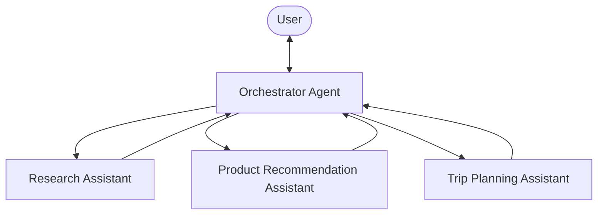

## The concept: agents as tools

When one agent needs expertise outside its focus, wrap a specialized agent as a callable tool and let an orchestrator agent delegate to it. This creates a hierarchical structure:

1.  **A primary orchestrator agent** handles user interaction and decides which specialist to call
2.  **Specialized tool agents** perform domain-specific work when the orchestrator calls them

This mirrors how a manager coordinates specialists on a team, each bringing focused expertise. Rather than one agent handling everything, each task goes to the agent best suited to it. Each specialist keeps a focused area of responsibility, the orchestrator owns a clear chain of command, and specialists can be added, removed, or tuned independently, each with its own system prompt and tools.

## Implementing the pattern

Strands provides three ways to implement agents as tools: pass agents directly in the `tools` array for the simplest setup, use `.as_tool()``.asTool()` to customize tool name, description, or context behavior, and use the `@tool` decorator or `tool()` function for full control over how the agent is invoked.



### Passing agents directly

The simplest way to use an agent as a tool is to pass it directly in the `tools` array. The SDK automatically converts it into a tool that accepts an `input` string parameter and returns the agent’s text response.

(( tab "Python" ))
```python
from strands import Agent
from strands.vended_tools import http_request

# Create specialized agents
research_agent = Agent(
    system_prompt="""You are a specialized research assistant. Focus only on providing
    factual, well-sourced information in response to research questions.
    Always cite your sources when possible.""",
    tools=[http_request],
)

product_agent = Agent(
    system_prompt="""You are a specialized product recommendation assistant.
    Provide personalized product suggestions based on user preferences.""",
    tools=[http_request],
)

travel_agent = Agent(
    system_prompt="""You are a specialized travel planning assistant.
    Create detailed travel itineraries based on user preferences.""",
    tools=[http_request],
)

# Create the orchestrator: agents are automatically converted to tools
orchestrator = Agent(
    system_prompt="""You are an assistant that routes queries to specialized agents:
    - For research questions and factual information → Use the research_agent tool
    - For product recommendations and shopping advice → Use the product_agent tool
    - For travel planning and itineraries → Use the travel_agent tool
    - For simple questions not requiring specialized knowledge → Answer directly

    Always select the most appropriate tool based on the user's query.""",
    tools=[research_agent, product_agent, travel_agent],
)
```
(( /tab "Python" ))

(( tab "TypeScript" ))
```typescript
// Create specialized agents
const researchAgent = new Agent({
  name: 'research_agent',
  description:
    'Provides factual, well-sourced information in response to research questions.',
  systemPrompt: `You are a specialized research assistant. Focus only on providing
factual, well-sourced information in response to research questions.
Always cite your sources when possible.`,
  printer: false,
})

const productAgent = new Agent({
  name: 'product_agent',
  description: 'Provides personalized product suggestions based on user preferences.',
  systemPrompt: `You are a specialized product recommendation assistant.
Provide personalized product suggestions based on user preferences.`,
  printer: false,
})

const travelAgent = new Agent({
  name: 'travel_agent',
  description: 'Creates detailed travel itineraries based on user preferences.',
  systemPrompt: `You are a specialized travel planning assistant.
Create detailed travel itineraries based on user preferences.`,
  printer: false,
})

// Create the orchestrator: agents are automatically converted to tools
const orchestrator = new Agent({
  systemPrompt: `You are an assistant that routes queries to specialized agents:
- For research questions and factual information → Use the research_agent tool
- For product recommendations and shopping advice → Use the product_agent tool
- For travel planning and itineraries → Use the travel_agent tool
- For simple questions not requiring specialized knowledge → Answer directly

Always select the most appropriate tool based on the user's query.`,
  tools: [researchAgent, productAgent, travelAgent],
})
```
(( /tab "TypeScript" ))

### Customizing agent tools

When you need to customize the tool name, description, or context behavior, use `.as_tool()``.asTool()` explicitly:

(( tab "Python" ))
```python
orchestrator = Agent(
    system_prompt="You are an assistant that routes queries to specialized agents.",
    tools=[
        research_agent.as_tool(
            name="research_assistant",
            description="Process and respond to research-related queries requiring factual information.",
        ),
    ],
)
```
(( /tab "Python" ))

(( tab "TypeScript" ))
```typescript
const orchestrator = new Agent({
  systemPrompt: 'You are an assistant that routes queries to specialized agents.',
  tools: [
    researchAgent.asTool({
      name: 'research_assistant',
      description:
        'Process and respond to research-related queries requiring factual information.',
    }),
  ],
})
```
(( /tab "TypeScript" ))

#### Context management

By default, both direct passing and `.as_tool()``.asTool()` reset the agent’s conversation context between invocations, ensuring every call starts from a clean baseline. To preserve the agent’s conversation history across invocations:

(( tab "Python" ))
```python
# Agent will remember prior interactions within the same orchestrator session
orchestrator = Agent(
    system_prompt="You are an assistant that routes queries to specialized agents.",
    tools=[research_agent.as_tool(preserve_context=True)],
)
```
(( /tab "Python" ))

(( tab "TypeScript" ))
```typescript
// Agent will remember prior interactions within the same orchestrator session
const orchestrator = new Agent({
  systemPrompt: 'You are an assistant that routes queries to specialized agents.',
  tools: [researchAgent.asTool({ preserveContext: true })],
})
```
(( /tab "TypeScript" ))

### Creating custom agent tools

For more control over how the agent is invoked, such as custom pre/post-processing, error handling, or passing multiple parameters, create a custom tool that wraps an agent:

(( tab "Python" ))
```python
from strands import Agent, tool
from strands.vended_tools import http_request

RESEARCH_ASSISTANT_PROMPT = """
You are a specialized research assistant. Focus only on providing
factual, well-sourced information in response to research questions.
Always cite your sources when possible.
"""

@tool
def research_assistant(query: str) -> str:
    """
    Process and respond to research-related queries.

    Args:
        query: A research question requiring factual information

    Returns:
        A detailed research answer with citations
    """
    try:
        research_agent = Agent(
            system_prompt=RESEARCH_ASSISTANT_PROMPT,
            tools=[http_request]
        )

        response = research_agent(query)
        return str(response)
    except Exception as e:
        return f"Error in research assistant: {str(e)}"
```
(( /tab "Python" ))

(( tab "TypeScript" ))
```typescript
const researchAssistant = tool({
  name: 'research_assistant',
  description:
    'Process and respond to research-related queries requiring factual information.',
  inputSchema: z.object({
    query: z.string().describe('A research question requiring factual information'),
  }),
  callback: async (input) => {
    const researchAgent = new Agent({
      systemPrompt: `You are a specialized research assistant. Focus only on providing
factual, well-sourced information in response to research questions.
Always cite your sources when possible.`,
    })

    const response = await researchAgent.invoke(input.query)
    return response.lastMessage.content
      .map((block) => ('text' in block ? block.text : ''))
      .join('')
  },
})
```
(( /tab "TypeScript" ))

You can create multiple specialized agents following the same pattern:

(( tab "Python" ))
```python
@tool
def product_recommendation_assistant(query: str) -> str:
    """
    Handle product recommendation queries by suggesting appropriate products.

    Args:
        query: A product inquiry with user preferences

    Returns:
        Personalized product recommendations with reasoning
    """
    try:
        product_agent = Agent(
            system_prompt="""You are a specialized product recommendation assistant.
            Provide personalized product suggestions based on user preferences.""",
            tools=[http_request, dialog],
        )
        # Implementation with response handling
        # ...
        return processed_response
    except Exception as e:
        return f"Error in product recommendation: {str(e)}"

@tool
def trip_planning_assistant(query: str) -> str:
    """
    Create travel itineraries and provide travel advice.

    Args:
        query: A travel planning request with destination and preferences

    Returns:
        A detailed travel itinerary or travel advice
    """
    try:
        travel_agent = Agent(
            system_prompt="""You are a specialized travel planning assistant.
            Create detailed travel itineraries based on user preferences.""",
            tools=[http_request],
        )
        # Implementation with response handling
        # ...
        return processed_response
    except Exception as e:
        return f"Error in trip planning: {str(e)}"
```
(( /tab "Python" ))

(( tab "TypeScript" ))
```typescript
const productRecommendationAssistant = tool({
  name: 'product_recommendation_assistant',
  description:
    'Handle product recommendation queries by suggesting appropriate products.',
  inputSchema: z.object({
    query: z.string().describe('A product inquiry with user preferences'),
  }),
  callback: async (input) => {
    const productAgent = new Agent({
      systemPrompt: `You are a specialized product recommendation assistant.
Provide personalized product suggestions based on user preferences.`,
    })

    const response = await productAgent.invoke(input.query)
    return response.lastMessage.content
      .map((block) => ('text' in block ? block.text : ''))
      .join('')
  },
})

const tripPlanningAssistant = tool({
  name: 'trip_planning_assistant',
  description: 'Create travel itineraries and provide travel advice.',
  inputSchema: z.object({
    query: z
      .string()
      .describe('A travel planning request with destination and preferences'),
  }),
  callback: async (input) => {
    const travelAgent = new Agent({
      systemPrompt: `You are a specialized travel planning assistant.
Create detailed travel itineraries based on user preferences.`,
    })

    const response = await travelAgent.invoke(input.query)
    return response.lastMessage.content
      .map((block) => ('text' in block ? block.text : ''))
      .join('')
  },
})
```
(( /tab "TypeScript" ))

#### Creating the orchestrator agent

Create an orchestrator agent that has access to all specialized agents as tools:

(( tab "Python" ))
```python
from strands import Agent
from .specialized_agents import research_assistant, product_recommendation_assistant, trip_planning_assistant

MAIN_SYSTEM_PROMPT = """
You are an assistant that routes queries to specialized agents:
- For research questions and factual information → Use the research_assistant tool
- For product recommendations and shopping advice → Use the product_recommendation_assistant tool
- For travel planning and itineraries → Use the trip_planning_assistant tool
- For simple questions not requiring specialized knowledge → Answer directly

Always select the most appropriate tool based on the user's query.
"""

orchestrator = Agent(
    system_prompt=MAIN_SYSTEM_PROMPT,
    callback_handler=None,
    tools=[research_assistant, product_recommendation_assistant, trip_planning_assistant]
)
```
(( /tab "Python" ))

(( tab "TypeScript" ))
```typescript
const orchestrator = new Agent({
    systemPrompt: `You are an assistant that routes queries to specialized agents:
- For research questions and factual information → Use the research_assistant tool
- For recommendations and advice → Use the product_recommendation_assistant tool
- For travel planning and itineraries → Use the trip_planning_assistant tool
- For simple questions not requiring specialized knowledge → Answer directly

Always select the most appropriate tool based on the user's query.`,
    tools: [researchAssistant, productRecommendationAssistant, tripPlanningAssistant],
  })
```
(( /tab "TypeScript" ))

Here’s how this multi-agent setup might handle a complex user query:

(( tab "Python" ))
```python
# Example: e-commerce customer service system
customer_query = "I'm looking for hiking boots for a trip to Patagonia next month"

response = orchestrator(customer_query)

# This query can require multiple specialists. For example:
# 1. Call trip_planning_assistant to understand travel requirements for Patagonia
#    - Weather conditions in the region next month
#    - Typical terrain and hiking conditions
# 2. Call product_recommendation_assistant with that context to suggest boots
#    - Waterproof options for potential rain
#    - Proper ankle support for uneven terrain
#    - Brands known for durability in harsh conditions
# 3. Combine the specialist responses into one answer covering both the travel
#    planning and product recommendation aspects of the query
```
(( /tab "Python" ))

(( tab "TypeScript" ))
```typescript
const response = await orchestrator.invoke(
  "I'm looking for hiking boots for a trip to Patagonia next month"
)
```
(( /tab "TypeScript" ))

The orchestrator routes each aspect of the query to the specialist best suited to it, then combines their responses into a single answer that spans both domains.

## Delegation

Sometimes, you do not want a sub-agent’s response to be re-processed by the orchestrator agent, since it would incur unnecessary token usage and potentially corrupt the sub-agent’s response. For example:

-   A coding agent returning generated source code that shouldn’t be rephrased
-   A customer service agent whose compliance-reviewed language must reach the user unchanged
-   A retrieval agent returning structured data the caller consumes directly

In that case, you can mark a tool agent as a delegate by passing `delegate: true` to `.as_tool()``.asTool()`. When you do so, the orchestrator agent returns the delegate’s response directly to the user, skipping the extra orchestrator model round-trip.

(( tab "Python" ))
```python
from pydantic import BaseModel
from strands import Agent


class BillingResponse(BaseModel):
    summary: str
    refund_amount: float


billing_agent = Agent(
    name="billing_expert",
    description="Answers billing questions: charges, refunds, and invoices.",
    system_prompt="You handle billing questions with precision.",
    structured_output_model=BillingResponse,
)

orchestrator = Agent(
    system_prompt="""Route billing questions to billing_expert.
Answer general questions yourself.""",
    tools=[billing_agent.as_tool(delegate=True)],
)

result = orchestrator("Why was I charged twice?")
# result contains the billing agent's structured JSON response, unchanged
```
(( /tab "Python" ))

(( tab "TypeScript" ))
```typescript
const BillingResponseSchema = z.object({
    summary: z.string(),
    refundAmount: z.number(),
  })

  const billingAgent = new Agent({
    name: 'billing_expert',
    description: 'Answers billing questions: charges, refunds, and invoices.',
    systemPrompt: 'You handle billing questions with precision.',
    structuredOutputSchema: BillingResponseSchema,
    printer: false,
  })

  const orchestrator = new Agent({
    systemPrompt: `Route billing questions to billing_expert.
Answer general questions yourself.`,
    tools: [billingAgent.asTool({ delegate: true })],
  })

  const result = await orchestrator.invoke('Why was I charged twice?')
  // result contains the billing agent's structured JSON response, unchanged
```
(( /tab "TypeScript" ))

On success, the agent loop stops with `stop_reason == 'end_turn'``stopReason === 'endTurn'` and the `AgentResult` contains the delegate’s content without additional model processing. Streaming events from the delegate surface natively in the parent’s stream, so callers see the specialist’s tokens as they arrive.

Limitations to be aware of:

-   **Single delegated tool per turn**: An agent can have both delegated and non-delegated tools. However, if the agent calls a delegated tool during a turn, that tool must be called alone. The SDK cancels the tool batch if other tools are requested alongside the delegated tool.
-   **Incompatible with stateful models**: Delegation exits the agent loop early, which would leave an unclosed function call on the server for models that manage conversation state server-side. Combining delegated tools with stateful models is not supported.

## Remote agents with A2A

You can also use remote agents as tools through the [Agent-to-Agent (A2A) protocol](/docs/user-guide/sdk/multi-agent/agent-to-agent/index.md). The `A2AAgent` class lets you wrap a remote A2A-compatible agent as a tool in your orchestrator, following the same pattern described above but communicating over the network. See [A2AAgent as a Tool](/docs/user-guide/sdk/multi-agent/agent-to-agent/index.md#as-a-tool) for details.

## Best practices

-   **Clear tool documentation**: Write descriptive names and descriptions that explain the agent’s expertise
-   **Focused system prompts**: Keep each specialized agent tightly focused on its domain
-   **Proper response handling**: Use consistent patterns to extract and format responses
-   **Tool selection guidance**: Give the orchestrator clear criteria for when to use each specialized agent

## Complete working example

For complete implementations of this pattern, see the following examples:

(( tab "Python" ))
The [Teacher’s Assistant](/examples/index.md) example demonstrates an orchestrator agent that routes student queries to specialized agents for math, English, language translation, computer science, and general knowledge.
(( /tab "Python" ))

(( tab "TypeScript" ))
The [Agents as Tools](https://github.com/strands-agents/harness-sdk/tree/main/strands-ts/examples/agents-as-tools) example demonstrates an orchestrator agent that routes student queries to specialized tool agents for math, English, computer science, and general knowledge.
(( /tab "TypeScript" ))

## Related pages

- [A2A Server Configuration](/docs/user-guide/sdk/multi-agent/a2a-server-configuration/index.md) (1 shared tag)
- [Agent Workflows: Building Multi-Agent Systems with Strands Agents SDK](/docs/user-guide/sdk/multi-agent/workflow/index.md) (1 shared tag)
- [Agent-to-Agent (A2A) Protocol](/docs/user-guide/sdk/multi-agent/agent-to-agent/index.md) (1 shared tag)
- [Coordinate multiple agents](/docs/user-guide/sdk/multi-agent/multi-agent-patterns/index.md) (1 shared tag)
- [Graph Components](/docs/user-guide/sdk/multi-agent/graph-components/index.md) (1 shared tag)
- [Graph Multi-Agent Pattern](/docs/user-guide/sdk/multi-agent/graph/index.md) (1 shared tag)
- [Swarm Multi-Agent Pattern](/docs/user-guide/sdk/multi-agent/swarm/index.md) (1 shared tag)
- [Attach and invoke tools](/docs/user-guide/sdk/tools/using-tools/index.md) (1 shared tag)
- [Community tools package](/docs/user-guide/sdk/tools/community-tools-package/index.md) (1 shared tag)
- [Create custom tools](/docs/user-guide/sdk/tools/custom-tools/index.md) (1 shared tag)


## Implementation

### Python

- [harness-sdk/strands-py/src/strands/agent/_agent_as_tool.py](https://github.com/strands-agents/harness-sdk/blob/main/strands-py/src/strands/agent/_agent_as_tool.py)
- [harness-sdk/strands-py/src/strands/agent/_agent_delegation.py](https://github.com/strands-agents/harness-sdk/blob/main/strands-py/src/strands/agent/_agent_delegation.py)

### TypeScript

- [harness-sdk/strands-ts/src/agent/agent-as-tool.ts](https://github.com/strands-agents/harness-sdk/blob/main/strands-ts/src/agent/agent-as-tool.ts)
- [harness-sdk/strands-ts/src/agent/agent-delegation.ts](https://github.com/strands-agents/harness-sdk/blob/main/strands-ts/src/agent/agent-delegation.ts)
