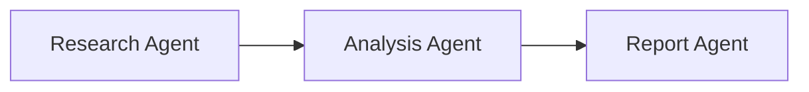

## Understanding Workflows

### What is an Agent Workflow?

An agent workflow coordinates tasks across multiple agents, where each agent performs a specialized function in a defined sequence. You break a complex problem into components, assign each to the agent best suited to it, and control the order, dependencies, and information flow between them. Use a workflow when a process needs a specific, repeatable execution pattern.

### Components of a Workflow Architecture

A workflow architecture consists of three key components:

#### 1\. Task Definition and Distribution

-   **Task Specification**: Clear description of what each agent needs to accomplish
-   **Agent Assignment**: Matching tasks to agents with appropriate capabilities
-   **Priority Levels**: Determining which tasks should execute first when possible

#### 2\. Dependency Management

-   **Sequential Dependencies**: Tasks that must execute in a specific order
-   **Parallel Execution**: Independent tasks that can run simultaneously
-   **Join Points**: Where multiple parallel paths converge before continuing

#### 3\. Information Flow

-   **Input/Output Mapping**: Connecting one agent’s output to another’s input
-   **Context Preservation**: Maintaining relevant information throughout the workflow
-   **State Management**: Tracking the overall workflow progress

### When to Use a Workflow

Workflows excel in scenarios requiring structured execution and clear dependencies:

-   **Complex Multi-Step Processes**: Tasks with distinct sequential stages
-   **Specialized Agent Expertise**: Processes requiring different capabilities at each stage
-   **Dependency-Heavy Tasks**: When certain tasks must wait for others to complete
-   **Resource Optimization**: Running independent tasks in parallel while managing dependencies
-   **Error Recovery**: Retrying specific failed steps without restarting the entire process
-   **Long-Running Processes**: Tasks requiring monitoring, pausing, or resuming capabilities
-   **Audit Requirements**: When detailed tracking of each step is necessary

Consider other approaches (swarms or graphs) for simple tasks, highly collaborative problems, or situations requiring extensive agent-to-agent communication.

## Implementing Workflow Architectures

### Creating Workflows with Strands Agents

Strands Agents SDK allows you to create workflows using existing Agent objects, even when they use different model providers or have different configurations.

#### Sequential Workflow Architecture



In a sequential workflow, agents process tasks in a defined order, with each agent’s output becoming the input for the next:

```python
from strands import Agent

# Create specialized agents
researcher = Agent(system_prompt="You are a research specialist. Find key information.", callback_handler=None)
analyst = Agent(system_prompt="You analyze research data and extract insights.", callback_handler=None)
writer = Agent(system_prompt="You create polished reports based on analysis.")

# Sequential workflow processing
def process_workflow(topic):
    # Step 1: Research
    research_results = researcher(f"Research the latest developments in {topic}")

    # Step 2: Analysis
    analysis = analyst(f"Analyze these research findings: {research_results}")

    # Step 3: Report writing
    final_report = writer(f"Create a report based on this analysis: {analysis}")

    return final_report
```

This sequential workflow creates a pipeline where each agent’s output becomes the input for the next agent, allowing for specialized processing at each stage. For a functional example of sequential workflow implementation, see the [agents\_workflow.py](https://github.com/strands-agents/harness-sdk/blob/main/site/docs/examples/python/agents_workflow.py) example in the Strands Agents SDK documentation.

## Conclusion

Workflows give you explicit control over multi-step processes: a defined execution order, managed dependencies, and context passed between stages. Use the built-in `workflow` tool when you want that orchestration handled for you, or implement the coordination yourself when a step needs custom behavior.

## Related pages

- [A2A Server Configuration](/docs/user-guide/sdk/multi-agent/a2a-server-configuration/index.md) (1 shared tag)
- [Agent-to-Agent (A2A) Protocol](/docs/user-guide/sdk/multi-agent/agent-to-agent/index.md) (1 shared tag)
- [Coordinate multiple agents](/docs/user-guide/sdk/multi-agent/multi-agent-patterns/index.md) (1 shared tag)
- [Graph Components](/docs/user-guide/sdk/multi-agent/graph-components/index.md) (1 shared tag)
- [Graph Multi-Agent Pattern](/docs/user-guide/sdk/multi-agent/graph/index.md) (1 shared tag)
- [Swarm Multi-Agent Pattern](/docs/user-guide/sdk/multi-agent/swarm/index.md) (1 shared tag)
- [Agents as tools](/docs/user-guide/sdk/multi-agent/agents-as-tools/index.md) (1 shared tag)
- [Interrupts in Multi-Agent Systems](/docs/user-guide/sdk/interrupts-multi-agent/index.md) (1 shared tag)
