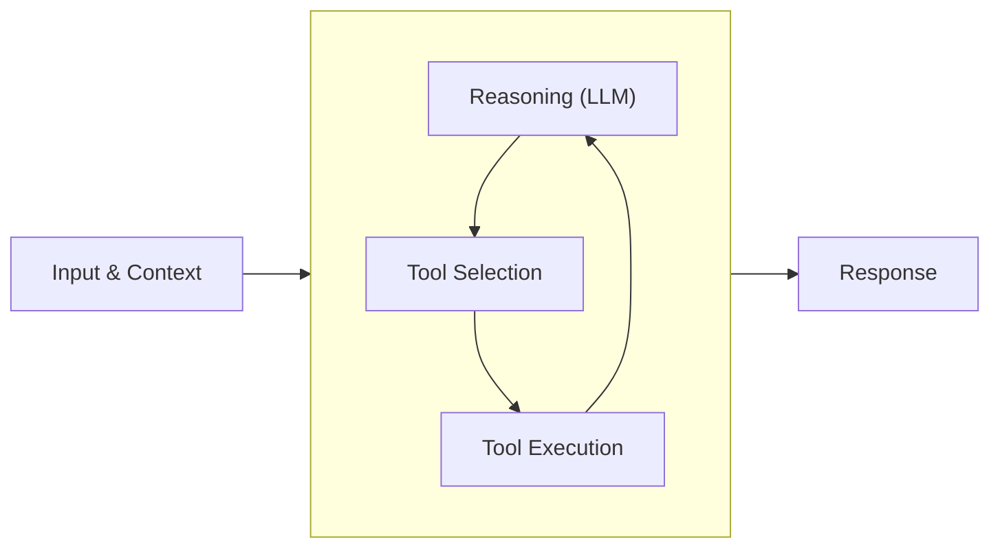

This quickstart takes you to a first running agent in TypeScript: install the SDK, pick a model provider, run the agent, then give it a tool. Everything past that (streaming, memory, observability, deployment) has its own guide, linked from [next steps](#next-steps).

**Using a coding agent?** Copy this prompt into Codex, Claude Code, Kiro, or any coding assistant and it will walk you through this page, ask which model provider you want, and offer to set up the Strands MCP server.

Copy prompt

## Install the Strands Harness SDK

Make sure you have Node.js 22+ and npm installed. See the [npm docs](https://docs.npmjs.com/downloading-and-installing-node-js-and-npm) if you need to set them up. Then, in a new project directory, initialize it and install the SDK:

```bash
npm init -y
npm pkg set type=module
npm install @strands-agents/sdk zod
npm install --save-dev @types/node typescript
```

## Run your first agent

Strands works with any major model provider. The model is one object you hand to the agent, and the rest of your code is the same no matter which provider is behind it. The tabs below cover the most common providers; pick the one you already have access to, then create `src/agent.ts` with the snippet from that tab:

(( tab "Amazon Bedrock" ))
Amazon Bedrock is the default provider, using Claude Sonnet 4.6, so no extra install or model object is needed.

```typescript
import { Agent } from '@strands-agents/sdk'

// Bedrock is the default, so no model object is needed.
const agent = new Agent()
const result = await agent.invoke('What is an agent harness, in one sentence?')
console.log(result.lastMessage)
```

Give the SDK AWS credentials with permission to invoke the model, using one of:

-   **Bedrock API key**: set the `AWS_BEARER_TOKEN_BEDROCK` environment variable to a [Bedrock API key](https://docs.aws.amazon.com/bedrock/latest/userguide/api-key-management.html). Quickest for local development.
-   **AWS credentials**: `aws configure`, or the `AWS_ACCESS_KEY_ID`, `AWS_SECRET_ACCESS_KEY`, and optionally `AWS_SESSION_TOKEN` environment variables
-   **IAM roles**: on AWS services like EC2, ECS, or Lambda

Enable access to the models you use in the Amazon Bedrock console, following the [AWS documentation](https://docs.aws.amazon.com/bedrock/latest/userguide/model-access-modify.html).
(( /tab "Amazon Bedrock" ))

(( tab "Anthropic" ))
```bash
npm install @anthropic-ai/sdk
export ANTHROPIC_API_KEY=<your key>
```

```typescript
import { Agent } from '@strands-agents/sdk'
import { AnthropicModel } from '@strands-agents/sdk/models/anthropic'

// Reads ANTHROPIC_API_KEY from the environment.
const model = new AnthropicModel({ modelId: 'claude-sonnet-5' })
const agent = new Agent({ model })
const result = await agent.invoke('What is an agent harness, in one sentence?')
console.log(result.lastMessage)
```
(( /tab "Anthropic" ))

(( tab "OpenAI" ))
```bash
npm install openai
export OPENAI_API_KEY=<your key>
```

```typescript
import { Agent } from '@strands-agents/sdk'
import { OpenAIModel } from '@strands-agents/sdk/models/openai'

// Reads OPENAI_API_KEY from the environment.
const model = new OpenAIModel({ modelId: 'gpt-5.4' })
const agent = new Agent({ model })
const result = await agent.invoke('What is an agent harness, in one sentence?')
console.log(result.lastMessage)
```
(( /tab "OpenAI" ))

(( tab "Google" ))
```bash
npm install @google/genai
export GEMINI_API_KEY=<your key>
```

```typescript
import { Agent } from '@strands-agents/sdk'
import { GoogleModel } from '@strands-agents/sdk/models/google'

// Reads GEMINI_API_KEY from the environment.
const model = new GoogleModel({ modelId: 'gemini-2.5-flash' })
const agent = new Agent({ model })
const result = await agent.invoke('What is an agent harness, in one sentence?')
console.log(result.lastMessage)
```
(( /tab "Google" ))

Run it with [`tsx`](https://tsx.is/):

```bash
npx tsx src/agent.ts
```

**Don’t see your provider?** Strands also supports the OpenAI Responses API, any provider in the Vercel AI SDK ecosystem, and any model behind a custom provider you write. Local models through Ollama are available in the Python SDK. [See all supported model providers](/docs/user-guide/sdk/model-providers/index.md).

## Add tools to your agent

You now have a working agent loop, but the agent has nothing to act with. It can only answer from what the model already knows. Tools are what let an agent do things: read a file, call an API, run a command, or look something up.

A tool is a function the model can decide to call. Tools come from two places: Strands ships [vended tools](/docs/user-guide/sdk/tools/vended-tools/index.md) for common jobs like editing files, running shell commands, and making HTTP requests, and you can turn any function of your own into a tool with `tool()`. You’ll use one of each.

Add this to the top of `src/agent.ts`. It imports the `fileEditor` vended tool and defines a custom `letterCounter` tool. The `description` and the Zod schema are what the model reads to decide when to call the tool and what to pass it:

```typescript
import { Agent, tool } from '@strands-agents/sdk'
import { fileEditor } from '@strands-agents/sdk/vended-tools/file-editor'
import z from 'zod'

// Define a custom tool as a TypeScript function
const letterCounter = tool({
  name: 'letter_counter',
  description:
    'Count occurrences of a specific letter in a word. Performs case-insensitive matching.',
  // Zod schema for letter counter input validation
  inputSchema: z
    .object({
      word: z.string().describe('The input word to search in'),
      letter: z.string().describe('The specific letter to count'),
    })
    .refine((data) => data.letter.length === 1, {
      message: "The 'letter' parameter must be a single character",
    }),
  callback: (input) => {
    const { word, letter } = input

    // Convert both to lowercase for case-insensitive comparison
    const lowerWord = word.toLowerCase()
    const lowerLetter = letter.toLowerCase()

    // Count occurrences
    let count = 0
    for (const char of lowerWord) {
      if (char === lowerLetter) {
        count++
      }
    }

    return `The letter '${letter}' appears ${count} time(s) in '${word}'`
  },
})
```

Then replace the agent creation with this. Both tools go in the `tools` array, and the prompt asks for something that needs each of them (keep your `model` line if you set one):

(( tab "Amazon Bedrock" ))
```typescript
const agent = new Agent({ tools: [letterCounter, fileEditor] })
const result = await agent.invoke(
  `How many letter R's are in the word "strawberry"? Write the answer to answer.txt.`
)
console.log(result.lastMessage)
```
(( /tab "Amazon Bedrock" ))

(( tab "Anthropic" ))
```typescript
const model = new AnthropicModel({ modelId: 'claude-sonnet-5' })
const agent = new Agent({ model, tools: [letterCounter, fileEditor] })
const result = await agent.invoke(
  `How many letter R's are in the word "strawberry"? Write the answer to answer.txt.`
)
console.log(result.lastMessage)
```
(( /tab "Anthropic" ))

(( tab "OpenAI" ))
```typescript
const model = new OpenAIModel({ modelId: 'gpt-5.4' })
const agent = new Agent({ model, tools: [letterCounter, fileEditor] })
const result = await agent.invoke(
  `How many letter R's are in the word "strawberry"? Write the answer to answer.txt.`
)
console.log(result.lastMessage)
```
(( /tab "OpenAI" ))

(( tab "Google" ))
```typescript
const model = new GoogleModel({ modelId: 'gemini-2.5-flash' })
const agent = new Agent({ model, tools: [letterCounter, fileEditor] })
const result = await agent.invoke(
  `How many letter R's are in the word "strawberry"? Write the answer to answer.txt.`
)
console.log(result.lastMessage)
```
(( /tab "Google" ))

Run it again. The model works out that counting letters is what `letter_counter` is for and that writing a file is what `fileEditor` is for, calls both, and you end up with an `answer.txt` in your working directory. You wrote one of those tools; the other came with the SDK.

Note

The `tool()` function also accepts plain JSON Schema objects instead of Zod. See [Creating Custom Tools](/docs/user-guide/sdk/tools/custom-tools/index.md) for details.

## What just happened

The agent decides when to call a tool based on the request, loops until it has an answer, and streams the response to your console.



Every invocation returns an `AgentResult` carrying the run’s messages, metrics, and traces. The [Agent Loop](/docs/user-guide/sdk/agents/agent-loop/index.md) explains the cycle above, and [Observability](/docs/user-guide/sdk/observability-evaluation/observability/index.md) covers reading traces and metrics. To silence the streamed console output, pass `printer: false` when creating the agent.

## Connect your AI coding assistant

Strands ships an [MCP server](https://github.com/strands-agents/harness-sdk/tree/main/strands-mcp) that gives AI coding assistants in your IDE live access to the Strands documentation — search, section browsing, and on-demand fetching — so the code they generate follows current APIs. It helps you build, but it isn’t required to run an agent.

The server requires [uv](https://github.com/astral-sh/uv#installation). Once uv is installed, add the server to your AI coding tool:

(( tab "Kiro" ))
Add the following to `~/.kiro/settings/mcp.json`:

```json
{
  "mcpServers": {
    "strands-agents": {
      "command": "uvx",
      "args": ["strands-agents-mcp-server"],
      "disabled": false,
      "autoApprove": ["search_docs", "fetch_doc"]
    }
  }
}
```

See the [Kiro MCP documentation](https://kiro.dev/docs/mcp/configuration/) for more details.
(( /tab "Kiro" ))

(( tab "Claude Code" ))
Run the following command:

```bash
claude mcp add strands uvx strands-agents-mcp-server
```

See the [Claude Code MCP documentation](https://docs.anthropic.com/en/docs/claude-code/tutorials#configure-mcp-servers) for more details.
(( /tab "Claude Code" ))

(( tab "Cursor" ))
Add the following to `~/.cursor/mcp.json`:

```json
{
  "mcpServers": {
    "strands-agents": {
      "command": "uvx",
      "args": ["strands-agents-mcp-server"]
    }
  }
}
```

See the [Cursor MCP documentation](https://docs.cursor.com/context/model-context-protocol#configuring-mcp-servers) for more details.
(( /tab "Cursor" ))

(( tab "Codex" ))
Add the following to `~/.codex/config.toml`:

```toml
[mcp_servers.strands-agents]
command = "uvx"
args = ["strands-agents-mcp-server"]
```

See the [Codex MCP documentation](https://github.com/openai/codex) for more details.
(( /tab "Codex" ))

(( tab "VS Code" ))
Add the following to your `mcp.json` file:

```json
{
  "servers": {
    "strands-agents": {
      "command": "uvx",
      "args": ["strands-agents-mcp-server"]
    }
  }
}
```

See the [VS Code MCP documentation](https://code.visualstudio.com/docs/copilot/customization/mcp-servers) for more details.
(( /tab "VS Code" ))

(( tab "Other" ))
The Strands MCP server works with [40+ applications that support MCP](https://modelcontextprotocol.io/clients). The general configuration is:

-   **Command:** `uvx`
-   **Args:** `["strands-agents-mcp-server"]`
(( /tab "Other" ))

Verify the connection with the [MCP Inspector](https://modelcontextprotocol.io/docs/tools/inspector):

```bash
npx @modelcontextprotocol/inspector uvx strands-agents-mcp-server
```

## Next Steps

You have a running agent with a tool. From here:

-   [Vended Tools](/docs/user-guide/sdk/tools/vended-tools/index.md) - file editing, shell, HTTP, and more, ready to drop into `tools`
-   [MCP Tools](/docs/user-guide/sdk/tools/mcp-tools/index.md) - connect to external tool servers
-   [Examples](https://github.com/strands-agents/harness-sdk/tree/main/strands-ts/examples) - agents for many use cases
-   [Model Providers](/docs/user-guide/sdk/model-providers/index.md) - every supported provider and its options
-   [Agent Loop](/docs/user-guide/sdk/agents/agent-loop/index.md) - how Strands agents work under the hood
-   [Context Management](/docs/user-guide/sdk/context-management/index.md) - keep long conversations inside the model’s context window
-   [Memory](/docs/user-guide/sdk/memory/overview/index.md) - give the agent long-term memory across sessions with memory stores
-   [State](/docs/user-guide/sdk/agents/state/index.md) - how agents keep context across a conversation
-   [Streaming](/docs/user-guide/sdk/streaming/index.md) - stream events to a UI with async iterators
-   [TypeScript SDK Repository](https://github.com/strands-agents/harness-sdk/tree/main/strands-ts) - explore the source and contribute
-   [Operating Agents in Production](/docs/user-guide/sdk/deploy/operating-agents-in-production/index.md) - take agents from development to production at scale

## Related pages

- [Choosing an Agent Foundation](/docs/user-guide/migrate/choosing-an-agent-foundation/index.md) (1 shared tag)
- [Get started](/docs/user-guide/sdk/quickstart/overview/index.md) (1 shared tag)
- [Python Quickstart](/docs/user-guide/sdk/quickstart/python/index.md) (1 shared tag)
- [Strands evaluation quickstart](/docs/user-guide/evals-sdk/quickstart/index.md) (1 shared tag)
- [Strands Shell quickstart](/docs/user-guide/shell/quickstart/index.md) (1 shared tag)
- [Red teaming quickstart](/docs/user-guide/evals-sdk/red-teaming/quickstart/index.md) (1 shared tag)
- [Build a voice agent](/docs/user-guide/sdk/bidirectional-streaming/quickstart/index.md) (1 shared tag)
